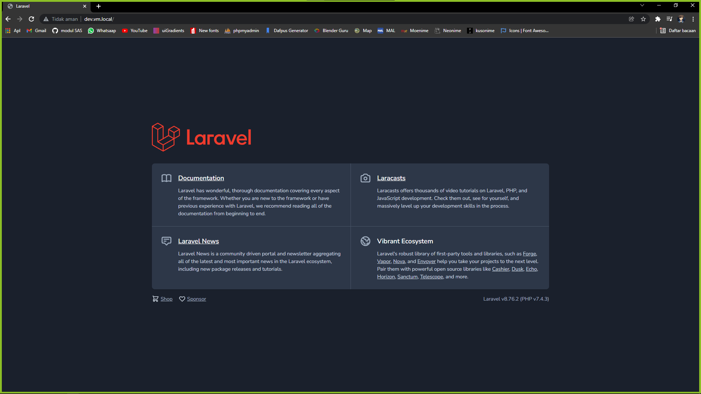
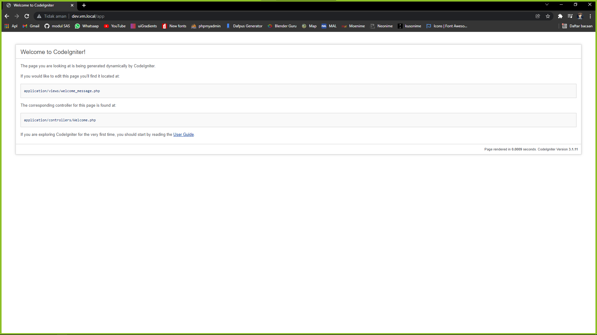
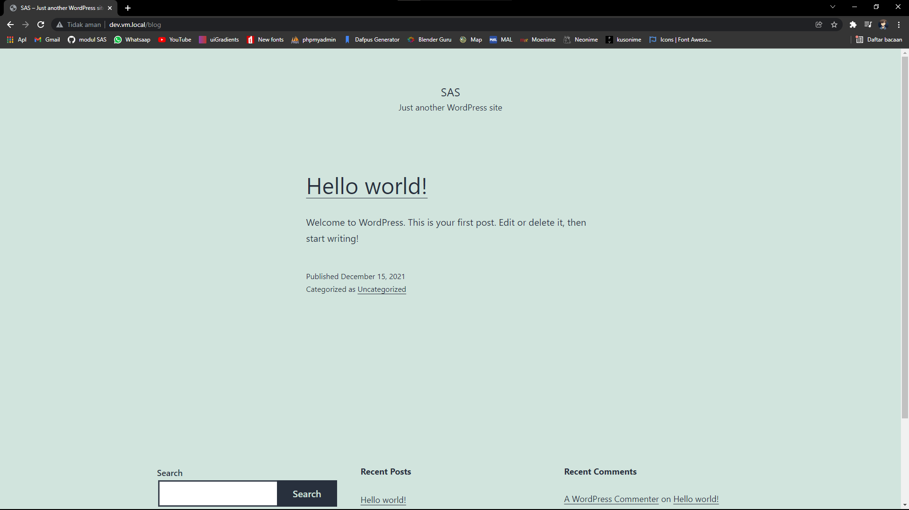
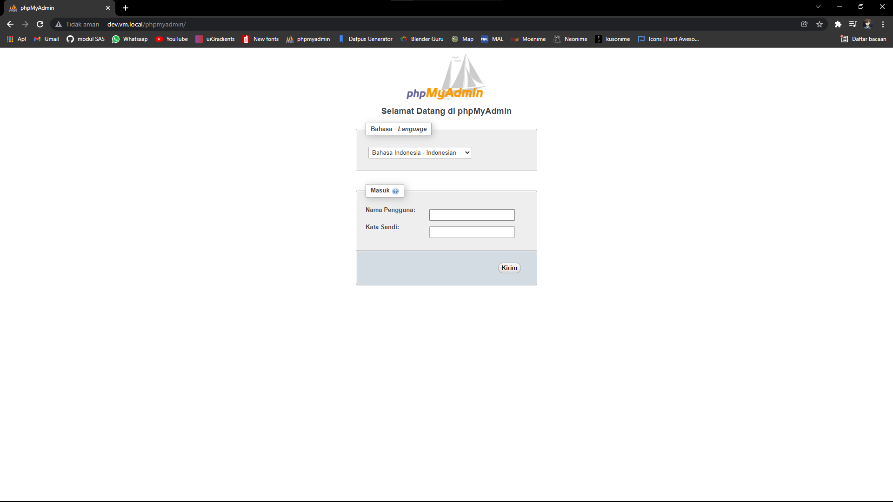

# Report [Team 12] : Modul 3 - DNS & Load Balancer

## Case Study

Create SubDomain dev.vm.local with some rules:

- Ansible.
- Same lxc like vm.local .
- The folder must be in /var/www/html/dev/{name_app}.

## Problem Solving

- First we need to add some syntax ansible in php roles on tasks directory `cd ~/ansible/modul2-ansible/roles/php/tasks`.

- Than, we can type command `nano main.yml` and add syntax as below.

  ```
  ---
  - name: delete apt chache
    become: yes
    become_user: root
    become_method: su
    command: rm -vf /var/lib/apt/lists/*
  
  - name: install php
    become: yes
    become_user: root
    become_method: su
    apt: name={{ item }} state=latest update_cache=true
    with_items:
      - gtkhash
      - bind9
      - dnsutils
      - crack-md5
      - git
      - curl
      - nginx
      - nginx-extras
      - php7.4
      - php7.4-fpm
      - php7.4-curl
      - php7.4-xml
      - php7.4-gd
      - php7.4-opcache
      - php7.4-mbstring
      - php7.4-zip
      - php7.4-json
      - php7.4-cli
  
  - name: enable module php mbstring
    command: phpenmod mbstring
    notify:
      - restart php
  ```

- Go to the main.yml file in Laravel roles by type `cd ~/ansible/modul2-ansible/roles/laravel/tasks; nano main.yml`  and add some syntax in as below.

  ```
  - name: make directory
    file:
      path: /var/www/html/dev/landing
      state: directory
  
  - name: copy named.conf.local
    template:
      src=templates/named.conf.local
      dest=/var/www/html/dev/landing
    notify:
      - restart bind
  
  - name: copy vm.local
    template:
      src=templates/vm.local
      dest=/var/www/html/dev/landing
    notify:
      - restart bind
  
  - name: copy 1.168.192.in-addr.arpa
    template:
      src=templates/1.168.192.in-addr.arpa
      dest=/var/www/html/dev/landing
    notify:
      - restart bind
  
  - name: copy resolv.conf
    template:
      src=templates/resolv.conf
      dest=/etc/resolv.conf
  
  - name: copy named.conf.options
    template:
      src=templates/named.conf.options
      dest=/var/www/html/dev/landing
    notify:
      - restart bind
  ```

- Go to the templates directory in Laravel roles by type `cd ~/ansible/modul2-ansible/roles/laravel/templates`  and add some new file by type syntax as below.

  ```
  nano named.conf.local
  ```

  ```
  //
  // Do any local configuration here
  //
  
  // Consider adding the 1918 zones here, if they are not used in your
  // organization
  //include "/etc/bind/zones.rfc1918";
  
  zone "vm.local" {
          type master;
          file "/etc/bind/vm/vm.local";
  };
  
  zone "1.168.192.in-addr.arpa" {
          type master;
          file "/etc/bind/vm/1.168.192.in-addr.arpa";
  };
  ```

  ```
  nano vm.local
  ```

  ```
  ;
  ; BIND data file for local loopback interface
  ;
  $TTL    604800
  @       IN      SOA     vm.local. root.vm.local. (
                                2         ; Serial
                           604800         ; Refresh
                            86400         ; Retry
                          2419200         ; Expire
                           604800 )       ; Negative Cache TTL
  ;
  @       IN      NS      vm.local.
  @       IN      A       192.168.1.19
  www     IN      CNAME   vm.local.
  ```

  ```
  nano 1.168.192.in-addr.arpa
  ```

  ```
  ;
  ; BIND data file for local loopback interface
  ;
  $TTL    604800
  @       IN      SOA     vm.local. root.vm.local. (
                                2         ; Serial
                           604800         ; Refresh
                            86400         ; Retry
                          2419200         ; Expire
                           604800 )       ; Negative Cache TTL
  ;
  1.168.192.in-addr.arpa. IN      NS      vm.local. ; IP VM dibalik tanpa byte ke 4
  19                      IN      PTR     vm.local. ; byte ke 4 IP VM
  ```

  ```
  nano resolv.conf
  ```

  ```
  # This file is managed by man:systemd-resolved(8). Do not edit.
  #
  # This is a dynamic resolv.conf file for connecting local clients to the
  # internal DNS stub resolver of systemd-resolved. This file lists all
  # configured search domains.
  #
  # Run "resolvectl status" to see details about the uplink DNS servers
  # currently in use.
  #
  # Third party programs must not access this file directly, but only through the
  # symlink at /etc/resolv.conf. To manage man:resolv.conf(5) in a different way,
  # replace this symlink by a static file or a different symlink.
  #
  # See man:systemd-resolved.service(8) for details about the supported modes of
  # operation for /etc/resolv.conf.
  
  #nameserver 127.0.0.53
  #options edns0 trust-ad
  nameserver 192.168.1.19
  ```

  ```
  nano named.conf.options
  ```

  ```
  options {
          directory "/var/cache/bind";
  
          // If there is a firewall between you and nameservers you want
          // to talk to, you may need to fix the firewall to allow multiple
          // ports to talk.  See http://www.kb.cert.org/vuls/id/800113
  
          // If your ISP provided one or more IP addresses for stable
          // nameservers, you probably want to use them as forwarders.
          // Uncomment the following block, and insert the addresses replacing
          // the all-0's placeholder.
  
          forwarders {
                  8.8.8.8;
          };
  
          //========================================================================
          // If BIND logs error messages about the root key being expired,
          // you will need to update your keys.  See https://www.isc.org/bind-keys
          //========================================================================
          //dnssec-validation auto;
          allow-query{any;};
  
          listen-on-v6 { any; };
  };
  ```

- Go to the handlers directory in Laravel roles by type `cd ~/ansible/modul2-ansible/roles/laravel/handlers`  and add some syntax to restart bind9 by type syntax as below.

  ```
  - name: restart bind
    become: yes
    become_user: root
    become_method: su
    action: service name=bind9 state=restarted
  ```

- After that, we need to start ansible to make changes to our lxc by typing command as below.

  ```
  ansible-playbook -i hosts install-laravel.yml -k
  ```

- Enter into lxc ubuntu_landing by typing `sudo lxc-attach ubuntu_landing` and go to the **landing** directory by type `/var/www/html/dev/landing`. `nano vm`. Add syntax to record CNAME with subdomain dev like syntax as below. Then restart it with command `sudo /etc/init.d/named restart`.

  ```
  ;
  ; BIND data file for local loopback interface
  ;
  $TTL    604800
  @       IN      SOA     vm.local. root.vm.local. (
                                2         ; Serial
                           604800         ; Refresh
                            86400         ; Retry
                          2419200         ; Expire
                           604800 )       ; Negative Cache TTL
  ;
  @       IN      NS      vm.local.
  @       IN      A       192.168.1.19
  dev     IN      CNAME   vm.local.
  www     IN      CNAME   vm.local.
  ```

- Add subdomain **dev.vm.local** in hosts file by type `sudo nano /etc/hosts` to enter hosts file and make it the same as the syntax below.

  ```
  127.0.0.1 localhost
  127.0.1.1 sas02
  127.0.1.1 vm.local www.vm.local dev.vm.local
  
  10.0.3.101      lxc_php7.dev
  10.0.3.102      lxc_php5.dev
  10.0.3.103      lxc_landing.dev
  10.0.3.200      lxc_mariadb.dev
  
  # The following lines are desirable for IPv6 capable hosts
  ::1     ip6-localhost ip6-loopback
  fe00::0 ip6-localnet
  ff00::0 ip6-mcastprefix
  ff02::1 ip6-allnodes
  ff02::2 ip6-allrouters
  ```

- Don't forget to add subdomain **dev.vm.local** in nginx configuration on main **vm.local** by typing `cd /etc/nginx/sites-available; nano vm.local`. we can type it like syntax as below.

  ```
  server {
          listen 80;
          listen [::]:80;
  
          server_name vm.local www.vm.local dev.vm.local;
  
          root /var/www/html;
          index index.html;
  
          location /app {
                  rewrite /app/?(.*)$ /$1 break;
                  proxy_pass http://lxc_php5.dev;
          }
  
          location /blog {
                  rewrite /blog/?(.*)$ /$1 break;
                  proxy_pass http://lxc_php7.dev;
          }
  
          location /phpmyadmin{
                  rewrite /phpmyadmin/?(.*)$ /$1 break;
                  proxy_pass http://lxc_mariadb.dev;
          }
  
          location / {
                  #rewrite /?(.*)$ /$1 break;
                  proxy_pass http://lxc_landing.dev;
          }
  }
  ```

- After that, we need to go to sites-enable to restart nginx, so we need to type command `cd /etc/nginx/sites-enabled; sudo nginx -t; sudo nginx -s reload`.

- Then, we can try it in our lovely browser and hopefully its works. I think :)

- **dev.vm.local**

  

- **dev.vm.local/app**

  

- **dev.vm.local/blog**

  

- **dev.vm.local/phpmyadmin/**

  

## Created By Team 12 [IT - 02 - 02]
- Muhammad Akbar Ramadhan [1202190019]
- Wiranti Maharani [1202190030]

